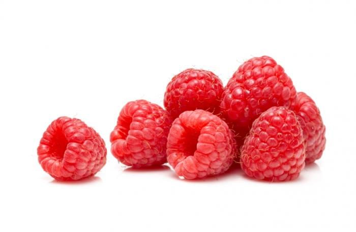

```{r setup, include=FALSE}
knitr::opts_chunk$set(echo = FALSE, warning = FALSE, message = FALSE)
pacman::p_load("knitr", "tidyverse", "magrittr", "kableExtra", "dplyr", "ggplot2")
```

## Goal & Background

**Goal:** To compare the weight of raspberries in different states with different chemical applications.

* Data collected from USDA database
* Dataset has 3 berries (raspberries, strawberries, and blueberries), only concerned with raspberries


## Data Cleaning (part 1)

Remove NAs and single-outcome columns.

```{r, echo=FALSE, warning=FALSE, message=FALSE}
ag_data <- read_csv("berries.csv", col_names = TRUE)
NA_cols <- which(sapply(ag_data, function(x)all(is.na(x))))
ag_data %<>% select(-all_of(NA_cols))
uni_cols <- sapply(ag_data, function(x) length(unique(x)))
ag_data %<>% subset(select = uni_cols > 1)
ag_data %<>% select(-`State ANSI`) 

kable(head(ag_data)) %>% kable_styling(font_size = 12)
```


## Data Cleaning (part 2)

Pull the raspberry data from the rest of the berries.

Determine and filter the Domain column to be only "TOTAL".



```{r, echo=TRUE, include=FALSE, warning=FALSE, message=FALSE}
ras <- ag_data %>% filter((Commodity=="RASPBERRIES") & (Period=="YEAR"))
ras %<>% select(-c(Period, Commodity))
ras$'Domain' %>% unique
d_total <- filter(ras, Domain=="TOTAL")
d_total$`Data Item` %>% unique()
d_total$`Domain Category` %>% unique()
ras <- filter(ras, Domain!="TOTAL")
```


## Data Cleaning (part 3)

Clean even further by separating items in columns.

```{r, echo=FALSE, warning=FALSE, message=FALSE}
ras %<>% separate(`Data Item`, c("Bearing", "Production"), sep = "-")
ras %<>% separate(Domain, c("D_left", "D_right"), sep = ", ")
ras[is.na(ras)] <- ""
ras$Chemical_Type <- ifelse(ras$D_left == "FERTILIZER", ras$D_left, ras$D_right)
ras %<>% separate(`Domain Category`, c("DC_left", "DC_right"), sep = ":")
ras[is.na(ras)] <- ""
ras %<>% rename(Chemicals = DC_right)
ras %<>% separate(Bearing, c("Berry", "Bearing"), sep = ",")
ras %<>% select(-Bearing)
ras %<>% separate(Production, c("Production", "Measurement"), sep = ",")
ras %<>% filter(Measurement == " MEASURED IN LB")
ras %<>% select(-c(D_right, D_left, DC_left, Berry))

kable(head(ras)) %>% kable_styling(font_size = 12)
```


## Exploratory Data Analysis (EDA) - Histogram 1

**Goal:** Look for patterns in the visualized data.

* Not much data in 2016 or 2018

```{r, echo=FALSE, warning=FALSE, message=FALSE}
ras_eda <- ras %>% select(Year, State, Measurement, Chemical_Type, Value)
ras_eda$Value %<>% as.numeric()
hist_year <- hist(ras_eda$Year, xlab = "Year", main = "Histogram of Years")
```


## EDA - Histogram 2

* Heavily right-skewed

```{r, echo=FALSE, warning=FALSE, message=FALSE}
hist_lbs <- hist(ras_eda$Value, xlab = "Number of Lbs", main = "Histogram of Value (in lbs)")
```


## EDA - Scatterplot

* Different colors represent different states

```{r, echo=FALSE, warning=FALSE, message=FALSE}
ggplot(data = ras_eda, mapping = aes(Chemical_Type,(Value))) + geom_jitter(aes(color = State)) + ggtitle("Scatterplot of Chemical Type vs. Lbs Produced") + xlab("Chemical Type") + ylab("Value in Lbs")
```


## EDA - Calculations

```{r, echo=FALSE, warning=FALSE, message=FALSE}
table_state <- ras_eda %>% group_by(State) %>% summarize(mean(Value, na.rm = TRUE))
table_year <- ras_eda %>% group_by(Year) %>% summarize(mean(Value, na.rm = TRUE))
table_chem <- ras_eda %>% group_by(Chemical_Type) %>% summarize(mean(Value, na.rm = TRUE))

kable(table_state) %>% kable_styling(font_size = 12)
kable(table_year) %>% kable_styling(font_size = 12)
kable(table_chem) %>% kable_styling(font_size = 12)
```


## Conclusion

**Goal:** To compare the weight of raspberries in different states with different chemical applications.

* Histograms
    * most raspberries were between 0 and 600 lbs
* Scatterplot
    * WA tends to have heavier raspberries than CA and OR
    * not many farms use herbicides (CA barely uses it at all)
* Tables
    * on average, WA has heavier raspberries
    * on average, OR has the lighest raspberries


## References
1. Bruce Cowles, Anna Cook. Personalized advice in meetings.
2. Hadley Wickham, Romain François, Lionel Henry and Kirill Müller (2020). dplyr: A Grammar of Data Manipulation. R package version 1.0.2. https://CRAN.R-project.org/package=dplyr
3. Hao Zhu (2020). kableExtra: Construct Complex Table with 'kable' and Pipe Syntax. R package version 1.2.1. https://CRAN.R-project.org/package=kableExtra
4. H. Wickham. ggplot2: Elegant Graphics for Data Analysis. Springer-Verlag New York, 2016.
5. Stefan Milton Bache and Hadley Wickham (2014). magrittr: A Forward-Pipe Operator for R. R package version 1.5. https://CRAN.R-project.org/package=magrittr
6. Wickham et al., (2019). Welcome to the tidyverse. Journal of Open Source Software, 4(43), 1686, https://doi.org/10.21105/joss.01686
7. Yihui Xie (2020). knitr: A General-Purpose Package for Dynamic Report Generation in R. R package version 1.29.
